# Distributed Systems

   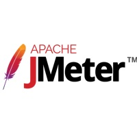

#### Netflix Open Source Software + Spring Boot Web Application

Netflix has committed to support, leverages and provides open source technology. Netflix is a pioneer on reliability, resilience and real-time data analytics leveraging a cloud based elastic deployments with several layers of failover.
As well as the ability to operate services while tracking peak performance, security and gaining insight. Netflix constantly delivers persistent real-time services to about 62 million members,
while their business intelligence and big data analytics allows them to make real-time informed decisions on how to improve their services.

More information here: [https://netflix.github.io/](https://netflix.github.io/)

#### Spring Boot Application

The Spring Boot is an application framework and inversion of control container for the Java platform. The framework's core features can be used by any Java application, but there are extensions for building web applications on top of the Java EE platform.
This framework provides a fast way to build applications as it helps with class path dependencies and configurations also provides a way to manage beans dependencies, wiring and injection. The Spring Boot framework was developed with the goal of
expending more time developing of business features and less on infrastructure.

More information here: [https://spring.io/](https://spring.io/)

#### Apache JMeter™

The Apache JMeter™ application is open source software, a 100% pure Java application designed to load test functional behavior and measure performance.

More information here: [http://jmeter.apache.org/index.html](http://jmeter.apache.org/index.html)


## Netflix OSS - Common Runtime Services & Libraries
**Runtime containers, libraries and services that power microservices**

On this application the Netflix cloud platform, runtime services and libraries were leveraged to create an fault tolerant application.
This technology stack is consider the backbone of the majority of the services within Netflix consisting of cloud services, libraries and containers.
Such as service discovery (Eureka), distributed configuration (Archaius) and resilent/intelligent processes and services communications (Ribbon).
By taking advance of this technology stack we can provide reliability beyond single service calls as well as to isolate latency and provide fault tolerance services at runtime (Hystrix).
Finally this project also provides dyamically scriptable proxying by utilizing Zuul that integrates with Hystrix, Eureka, and Ribbon to provides dynamic routing, monitoring, resiliency and security to services.


## Stack Description - Services & Libraries

#### Netflix/ribbon
* Ribbon is a Inter Process Communication (remote procedure calls) library with built in software load balancers. The primary usage model involves REST calls with various serialization scheme support.

#### Netflix/eureka
* AWS Service registry for resilient mid-tier load balancing and failover.

#### Netflix/Hystrix
* Hystrix is a latency and fault tolerance library designed to isolate points of access to remote systems, services and 3rd party libraries, stop cascading failure and enable resilience in complex distributed systems where failure is inevitable.

#### Netflix/zuul
* Zuul is a gateway service that provides dynamic routing, monitoring, resiliency, security, and more.


## Project Setup - Facility Management Microservice

This project consist of a RESTful API accessible on port 8888 where clients can make GET request to retrieve all the
entities in the database, one identity also DELETE and ADD request to the facility service. There is a load balancer at
the client and service level utilizing Ribbon and Hystrix fallback methods that are part of the Netfliz OSS technology stack
these features guarantee service resilience and reliability, the fallback method is implemented at the service and client
level to prevent server overload.

**Application Diagram**

|Graph| Fallback|
|-----|---------|
|||

## The Setup - Eight Node Cluster

For this project eight Lenovo laptops running CentOS 7 were configured and networked to create cluster of laptops
running on a private network. The client application is running in four of the nodes and the service application is
running in other four different nodes. Also there is a Master node that runs the admin, eureka and the gateway services.

|*MASTER*|*NODES*|
|--------|-------|
|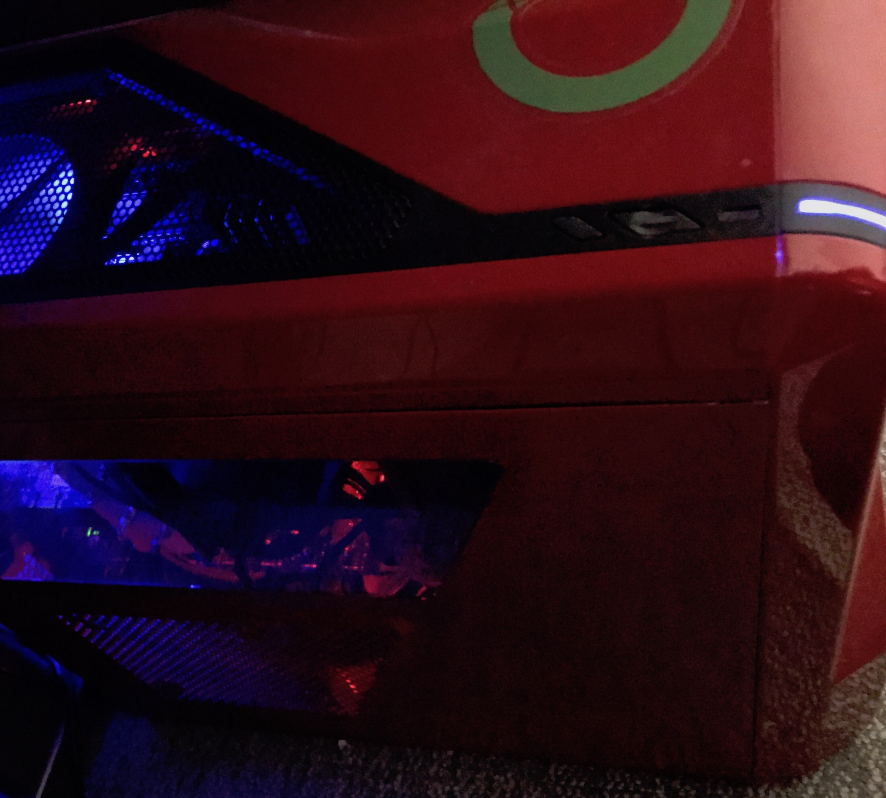||

-----

## Build

This project can be build using maven :

```
$ git clone https://github.com/jlroo/microservice.git
$ cd microservice/
$ mvn package
```

## Managing Services With SystemD

#### Writing systemD service
On Linux system we can use SystemD to manage applications. For this service a simple init script is use to simulate
an application running in a production environment.

```sh
$ cat /usr/lib/systemd/system/mgmt-system-facility.service

[Unit]
Description=Spring boot application service for the facility management system microservice

[Service]
ExecStart=/opt/mgmt-system/facility.jar

[Install]
WantedBy=multi-user.target
```

#### Enable, Start and Status check of the services  

```sh
$ sudo systemctl enable mgmt-system-eureka.service
Created symlink from /etc/systemd/system/multi-user.target.wants/mgmt-system-eureka.service to /usr/lib/systemd/system/mgmt-system-eureka.service.

$ sudo systemctl start mgmt-system-eureka.service

$ sudo systemctl status mgmt-system-eureka.service
● mgmt-system-eureka.service - AWS Service registry for resilient mid-tier load balancing and failover.
   Loaded: loaded (/usr/lib/systemd/system/mgmt-system-eureka.service; enabled; vendor preset: disabled)
   Active: active (running) since Thu 2017-04-27 13:21:09 CDT; 1min 58s ago
 Main PID: 11374 (eureka.jar)
   CGroup: /system.slice/mgmt-system-eureka.service
           ├─11374 /bin/bash /opt/mgmt-system/eureka.jar
           └─11391 /usr/bin/java -Dsun.misc.URLClassPath.disableJarChecking=true -jar /opt/mgmt-system/eureka.jar

Apr 27 13:21:45 eureka.jar[11374]: 2017-04-27 13:21:45.081  WARN 11391 --- [nio-8761-exec-1] c.n.eureka.resources.InstanceResource    : Not Found (Renew):...eureka:8761
Apr 27 13:21:45 eureka.jar[11374]: 2017-04-27 13:21:45.100  INFO 11391 --- [tbeatExecutor-0] com.netflix.discovery.DiscoveryClient    : DiscoveryClient_EU...apps/EUREKA
Apr 27 13:21:45 eureka.jar[11374]: 2017-04-27 13:21:45.101  INFO 11391 --- [tbeatExecutor-0] com.netflix.discovery.DiscoveryClient    : DiscoveryClient_EU... service...
Apr 27 13:21:45 eureka.jar[11374]: 2017-04-27 13:21:45.186  INFO 11391 --- [nio-8761-exec-2] c.n.e.registry.AbstractInstanceRegistry  : Registered instanc...tion=false)
Apr 27 13:21:45 eureka.jar[11374]: 2017-04-27 13:21:45.189  INFO 11391 --- [tbeatExecutor-0] com.netflix.discovery.DiscoveryClient    : DiscoveryClient_EU...status: 204
Apr 27 13:21:45 eureka.jar[11374]: 2017-04-27 13:21:45.733  INFO 11391 --- [nio-8761-exec-3] c.n.e.registry.AbstractInstanceRegistry  : Registered instanc...ation=true)
Apr 27 13:21:47 eureka.jar[11374]: 2017-04-27 13:21:47.002  INFO 11391 --- [nfoReplicator-0] com.netflix.discovery.DiscoveryClient    : DiscoveryClient_EU... service...
Apr 27 13:21:47 eureka.jar[11374]: 2017-04-27 13:21:47.011  INFO 11391 --- [nio-8761-exec-4] c.n.e.registry.AbstractInstanceRegistry  : Registered instanc...tion=false)
Apr 27 13:21:47 eureka.jar[11374]: 2017-04-27 13:21:47.013  INFO 11391 --- [nfoReplicator-0] com.netflix.discovery.DiscoveryClient    : DiscoveryClient_EU...status: 204
Apr 27 13:21:47 eureka.jar[11374]: 2017-04-27 13:21:47.524  INFO 11391 --- [nio-8761-exec-5] c.n.e.registry.AbstractInstanceRegistry  : Registered instanc...ation=true)
```
-----

#### Enable,Start and check status of the admin services  

```sh
$ sudo systemctl enable mgmt-system-admin.service
Created symlink from /etc/systemd/system/multi-user.target.wants/mgmt-system-admin.service to /usr/lib/systemd/system/mgmt-system-admin.service.

$ sudo systemctl start mgmt-system-admin.service

$ sudo systemctl status mgmt-system-admin.service
● mgmt-system-admin.service - Spring admin service console for the microservice
   Loaded: loaded (/usr/lib/systemd/system/mgmt-system-admin.service; enabled; vendor preset: disabled)
   Active: active (running) since Thu 2017-04-27 13:31:55 CDT; 7s ago
 Main PID: 24557 (admin.jar)
   CGroup: /system.slice/mgmt-system-admin.service
           ├─24557 /bin/bash /opt/mgmt-system/admin.jar
           └─24574 /usr/bin/java -Dsun.misc.URLClassPath.disableJarChecking=true -jar /opt/mgmt-system/admin.jar

Apr 27 13:32:02 admin.jar[24557]: 2017-04-27 13:32:02.374  INFO 24574 --- [           main] c.n.discovery.InstanceInfoReplicator     : InstanceInfoReplica...er min is 4
Apr 27 13:32:02 admin.jar[24557]: 2017-04-27 13:32:02.376  INFO 24574 --- [           main] com.netflix.discovery.DiscoveryClient    : Discovery Client in...es count: 1
Apr 27 13:32:02 admin.jar[24557]: 2017-04-27 13:32:02.404  INFO 24574 --- [           main] c.n.e.EurekaDiscoveryClientConfiguration : Registering applica...h status UP
Apr 27 13:32:02 admin.jar[24557]: 2017-04-27 13:32:02.405  INFO 24574 --- [           main] com.netflix.discovery.DiscoveryClient    : Saw local status ch...s=STARTING]
Apr 27 13:32:02 admin.jar[24557]: 2017-04-27 13:32:02.407  INFO 24574 --- [nfoReplicator-0] com.netflix.discovery.DiscoveryClient    : DiscoveryClient_ADM... service...
Apr 27 13:32:02 admin.jar[24557]: 2017-04-27  13:32:02.428  INFO 24574 --- [           main] d.c.b.a.registry.ApplicationRegistry     : New Application App... registered
Apr 27 13:32:02 admin.jar[24557]: 2017-04-27  13:32:02.453  INFO 24574 --- [nfoReplicator-0] com.netflix.discovery.DiscoveryClient    : DiscoveryClient_ADM...status: 204
Apr 27 13:32:02 admin.jar[24557]: 2017-04-27  13:32:02.585  INFO 24574 --- [           main] s.b.c.e.t.TomcatEmbeddedServletContainer : Tomcat started on p...8080 (http)
Apr 27 13:32:02 admin.jar[24557]: 2017-04-27  13:32:02.587  INFO 24574 --- [           main] c.n.e.EurekaDiscoveryClientConfiguration : Updating port to 8080
Apr 27 13:32:02 admin.jar[24557]: 2017-04-27  13:32:02.592  INFO 24574 --- [           main] e.l.c.s.admin.SpringAdminApplication     : Started SpringAdmin...g for 6.76)
```
----

#### Enable,Start and check status of the client services  

```sh
$ sudo systemctl enable mgmt-system-client.service
Created symlink from /etc/systemd/system/multi-user.target.wants/mgmt-system-client.service to /usr/lib/systemd/system/mgmt-system-client.service.

$ sudo systemctl start mgmt-system-client.service

$ sudo systemctl status mgmt-system-client.service
● mgmt-system-client.service - Spring boot client service for the facility management system microservice
   Loaded: loaded (/usr/lib/systemd/system/mgmt-system-client.service; enabled; vendor preset: disabled)
   Active: active (running) since Thu 2017-04-27 13:34:07 CDT; 25s ago
 Main PID: 27263 (client.jar)
   CGroup: /system.slice/mgmt-system-client.service
           ├─27263 /bin/bash /opt/mgmt-system/client.jar
           └─27280 /usr/bin/java -Dsun.misc.URLClassPath.disableJarChecking=true -jar /opt/mgmt-system/client.jar

Apr 27 13:34:07 systemd[1]: Started Spring boot client service for the facility management system microservice.
Apr 27 13:34:07 systemd[1]: Starting Spring boot client service for the facility management system microservice...
Apr 27 13:34:09 client.jar[27263]: .   ____          _            __ _ _
Apr 27 13:34:09 client.jar[27263]: /\\ / ___'_ __ _ _(_)_ __  __ _ \ \ \ \
Apr 27 13:34:09 client.jar[27263]: ( ( )\___ | '_ | '_| | '_ \/ _` | \ \ \ \
Apr 27 13:34:09 client.jar[27263]: \\/  ___)| |_)| | | | | || (_| |  ) ) ) )
Apr 27 13:34:09 client.jar[27263]: '  |____| .__|_| |_|_| |_\__, | / / / /
Apr 27 13:34:09 client.jar[27263]: =========|_|==============|___/=/_/_/_/
Apr 27 13:34:09 client.jar[27263]: :: Spring Boot ::        (v1.5.2.RELEASE)
```

-----

#### Enable,Start and check status of the facility services  

```sh
$ sudo systemctl enable mgmt-system-facility.service
Created symlink from /etc/systemd/system/multi-user.target.wants/mgmt-system-facility.service to /usr/lib/systemd/system/mgmt-system-facility.service.

$ sudo systemctl start mgmt-system-facility.service

$ sudo systemctl status mgmt-system-facility.service
● mgmt-system-facility.service - Spring boot application service for the facility management system microservice
   Loaded: loaded (/usr/lib/systemd/system/mgmt-system-facility.service; enabled; vendor preset: disabled)
   Active: active (running) since Thu 2017-04-27 13:54:46 CDT; 7s ago
 Main PID: 2151 (facility.jar)
   CGroup: /system.slice/mgmt-system-facility.service
           ├─2151 /bin/bash /opt/mgmt-system/facility.jar
           └─2168 /usr/bin/java -Dsun.misc.URLClassPath.disableJarChecking=true -jar /opt/mgmt-system/facility.jar

Apr 27 13:54:46 systemd[1]: Started Spring boot application service for the facility management system microservice.
Apr 27 13:54:46 systemd[1]: Starting Spring boot application service for the facility management system microservice...
Apr 27 13:54:48 facility.jar[2151]: .   ____          _            __ _ _
Apr 27 13:54:48 facility.jar[2151]: /\\ / ___'_ __ _ _(_)_ __  __ _ \ \ \ \
Apr 27 13:54:48 facility.jar[2151]: ( ( )\___ | '_ | '_| | '_ \/ _` | \ \ \ \
Apr 27 13:54:48 facility.jar[2151]: \\/  ___)| |_)| | | | | || (_| |  ) ) ) )
Apr 27 13:54:48 facility.jar[2151]: '  |____| .__|_| |_|_| |_\__, | / / / /
Apr 27 13:54:48 facility.jar[2151]: =========|_|==============|___/=/_/_/_/
Apr 27 13:54:48 facility.jar[2151]: :: Spring Boot ::        (v1.5.2.RELEASE)
```

## Running the JAR application

#### System Requirements
* Java 8 SDK or later

From the source directory go to the target folder, then run each application with the java compiler.
It is important to know that the client application depends on the network configuration of each service, in particular the
server that would run the Eureka and admin services that would help to manage the microservice.

|**ADMIN SERVICES**|**CLIENT APPLICATIONS**|
|------------------|-----------------------|
|`java -jar  eureka/target/eureka.jar`|`java -jar  client/target/client.jar`|
|`java -jar  admin/target/admin.jar`|`java -jar  facility/target/facility.jar`|
|`java -jar  admin/target/gateway.jar`||


## Application Routes

The application can be access locally or by connecting to the remote server hosting the application,
the REST client service can be access at port `8888`. The facility service can also be access directly but
first needs to identify the port where the service is running as by default the service starts at a random port also
for simplicity security management was not consider on this project, but with Spring Boot and Netflix OSS tech stack,
it should be fairly easy to add different layers of security. Another feature of this project is the ability to
create "chaos" on the application to test the resilience of the service. A route at the service level is open allowing for
changes on the failure rate (chaos rate controller) there is also an option to truncate the database.

#### Chaos rate controller - application/json - ChaosController.setRate()

* `http://localhost:0/facility/chaos/rate/{rate}`

#### Client Service Gateway

`http://localhost:8888/facility/`

|Routes|Response Type|Method|
|------|-------------|------|
|/facility/delete    |application/json |FacilityController.cleanDB()|
|/facility/{id}      |application/json | FacilityController.getFacility()|
|/facility/add       |application/json |FacilityController.addFacility()|
|/facility/all                      |application/json| FacilityController.getALL()|
|/facility/delete/{id}              |application/json| FacilityController.deleteByID()|
|/facility/maintenance/{id}         |application/json| MaintenanceController.getFacility()|
|/facility/maintenance/add          |application/json| MaintenanceController.addMaintenance()|
|/facility/maintenance/all          |application/json| MaintenanceController.getALL()|
|/facility/maintenance/delete/{id}  |application/json| MaintenanceController.deleteByID()|
|/facility/use/{id}                 |application/json| UseController.getMaintenance()|
|/facility/use/add                  |application/json| UseController.addFacilityUse()|
|/facility/use/all                  |application/json| UseController.getALL()|
|/facility/use/delete/{id}          |application/json| UseController.deleteByID()|


## Client Hystrix Dashboard

The diagram below shows one circuit from the dashboard along with explanations of what all of the data represents.
Hystrix packs a lot of information into the dashboard so that engineers can quickly consume and correlate data.

|Hystrix Dashboard Description|
|-----------------------------|
||

## Facility System Application Monitoring/Metrics

To monitor the application performance the Hystrix Dashboard service part of the Netflix OSS technology stack is used
to keep track of requests made to the service.

|Facility Client Snapshot   |
|-----------------------------|
|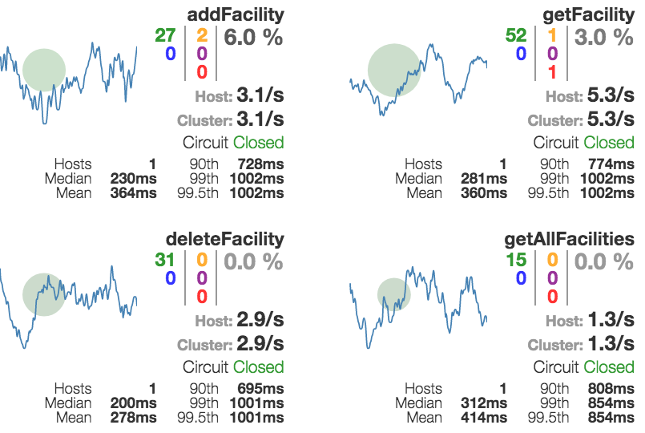|

## JMeter Service Performance Testing

Now that the application is up a running we can use Jmeter to make Http request to the server. First we can use the Jmetee 
GUI to setup the tests then we can run the test from there but for best practices and performance the tests should be run 
from the command line.
 
 **TEST GROUP:** Here we can see all the tests on this test plan also we can create random parameters, variables and many
 other features to mimic a client making Http requests to the service.
 
  
 
 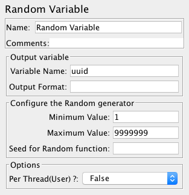 

Here is an example of the tests that this project used. First we need to setup the properties of the test (url,type of 
request,..), then we create the actual request and we are ready just need to run the test.

|Properties|Request|
|---|---|
||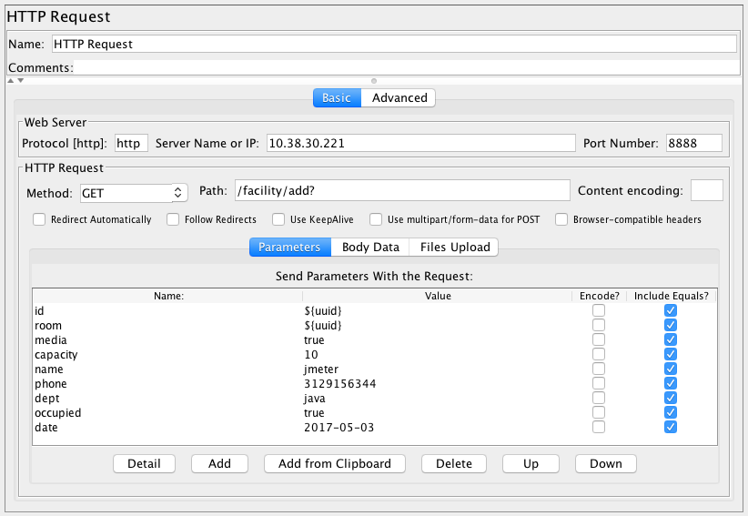|
|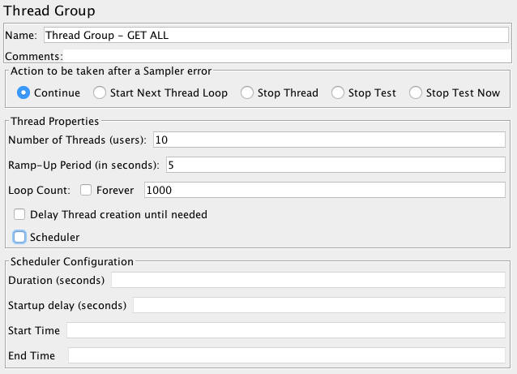|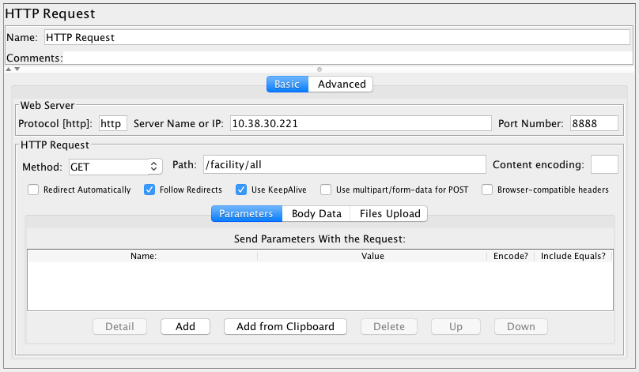|
|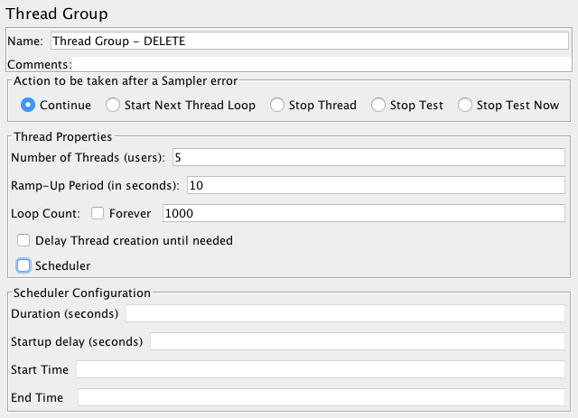|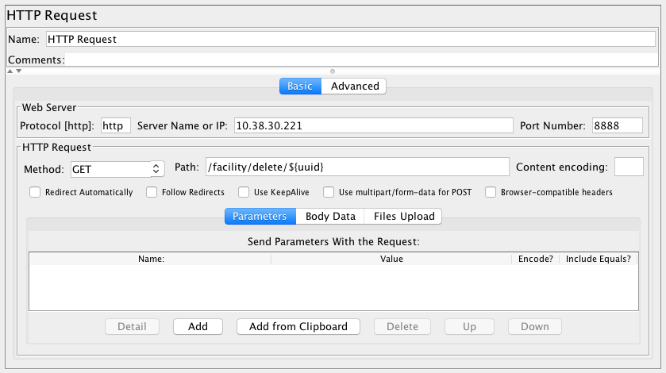|
|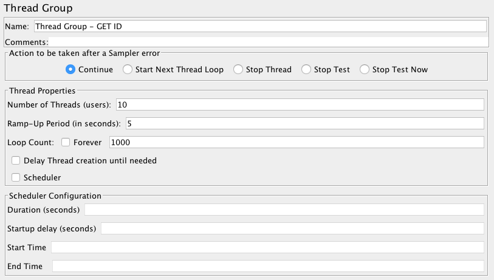|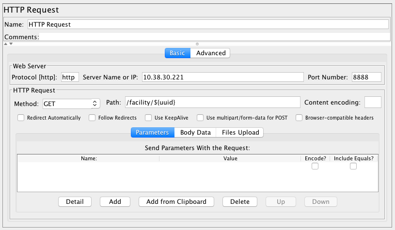|

## AWS RDS - PostgreSQL Database

[AmazonRDS - DBInstance](http://docs.aws.amazon.com/AmazonRDS/latest/UserGuide/Concepts.DBInstanceClass.html)

|Instance | Description|
----------|------------|
TypeType|Small Instance - Current Generation|
Number of virtual cores|	1 vCPU|
Memory|2 GiB|
Network Performance | Low
Free Tier Eligible|	Yes|

Default settings for maximum number of concurrent connections 'max_connections' settings :

* LEAST({DBInstanceClassMemory/9531392},5000)

 setting | min_val | max_val | boot_val | reset_val |
---------|---------|---------|----------|-----------|
 87      |  1      | 262143  | 100      | 87        |


To increase performance change to:
* GREATEST({DBInstanceClassMemory/9531392},5000)

More information about AWS RDS database metrics can be found here:
* [monitoring](http://docs.aws.amazon.com/AmazonCloudWatch/latest/monitoring/rds-metricscollected.html)

### Database Traffic Summary
**Network Transmit Throughput**

* The outgoing (Transmit) network traffic on the DB instance, including both customer database traffic and Amazon RDS traffic used for monitoring and replication.
* Units: Bytes/second

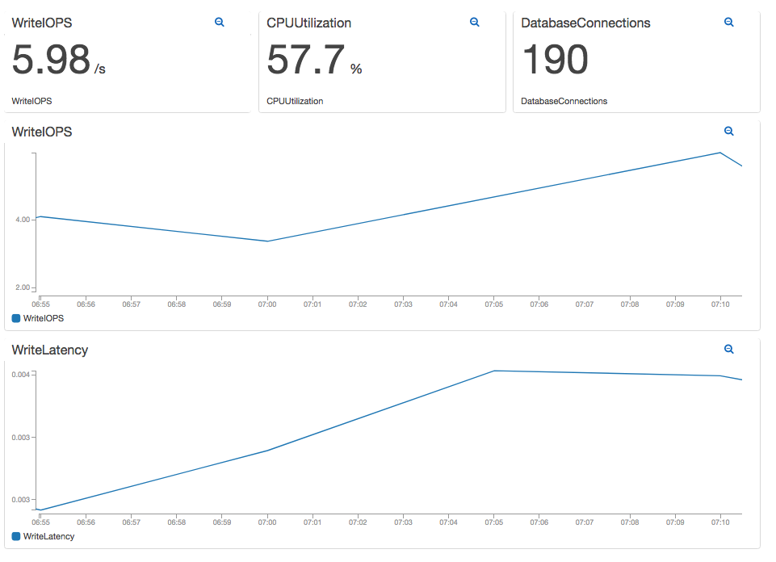


### Database Performance Summary
**WriteIOPS**

* The average number of disk I/O operations per second.
* Units: Count/Second

**WriteLatency**

* The average amount of time taken per disk I/O operation.
* Units: Seconds

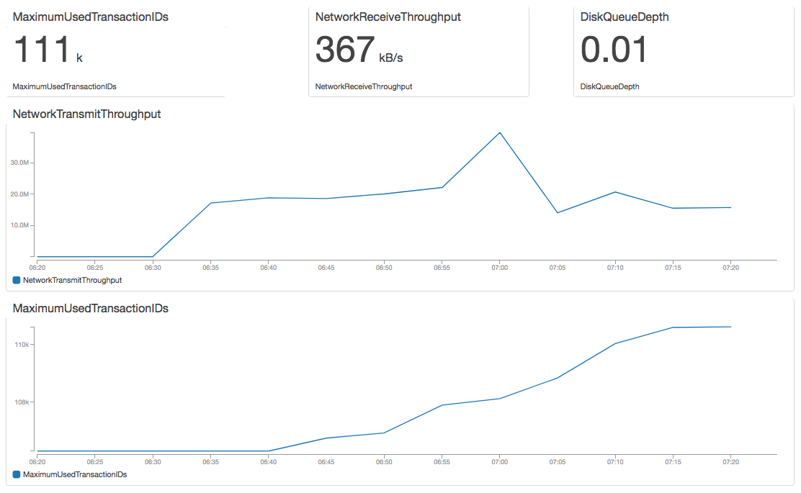


### DB Table Structure

```sh
psql (9.6.2, server 9.6.1)

facilitydb=> \d
                     List of relations
 Schema |             Name              |   Type   | Owner
--------+-------------------------------+----------+--------
 public | facility                      | table    | devops
 public | facility_details              | table    | devops
 public | facility_use                  | table    | devops
 public | facility_use_order_number_seq | sequence | devops
 public | inspection                    | table    | devops
 public | maintenance                   | table    | devops
(6 rows)

facilitydb=> \d facility

            Table "facility"
    Column     |  Type   | Modifiers
---------------+---------+-----------
 facility_id   | integer | not null
 facility_name | text    |
 room_number   | integer |
 media         | boolean |
 max_capacity  | integer |
Indexes:
    "facility_pkey" PRIMARY KEY, btree (facility_id)
Referenced by:
    TABLE "facility_details"
    TABLE "facility_use"
    TABLE "inspection"
    TABLE "maintenance"

facilitydb=> \d facility_details

        Table "facility_details"
     Column      |  Type   | Modifiers
-----------------+---------+-----------
 facility_id     | integer | not null
 phone_number    | text    |
 department      | text    |
 occupied        | boolean |
 inspection_date | date    |
Foreign-key constraints:
    "facility_details_facility_id_fkey"

facilitydb=> \d facility_use

           Table "facility_use"
      Column       |  Type   |      Modifiers
-------------------+---------+-------------------
 order_number      | integer | not null
 facility_id       | integer | not null
 customer_id       | integer | not null
 reservation_start | date    |
 reservation_end   | date    |
 inspection_date   | date    |
Foreign-key constraints:
    "facility_use_facility_id_fkey"


facilitydb=> \d inspection

            Table "inspection"
      Column       |  Type   | Modifiers
-------------------+---------+-----------
 facility_id       | integer | not null
 inspection_code   | text    |
 inspection_date   | date    |
 passed_inspection | boolean |
 description       | text    |
Foreign-key constraints:
    "inspection_facility_id_fkey"

facilitydb=> \d maintenance

            Table "maintenance"
       Column       |  Type   | Modifiers
--------------------+---------+-----------
 facility_id        | integer | not null
 start_work         | date    |
 end_work           | date    |
 facility_downtime  | numeric |
 maintenance_cost   | integer |
 maintenance_log    | text    |
 maintenance_status | text    |
Foreign-key constraints:
    "maintenance_facility_id_fkey"

```

# Project UML Diagram

### Composite Structure

